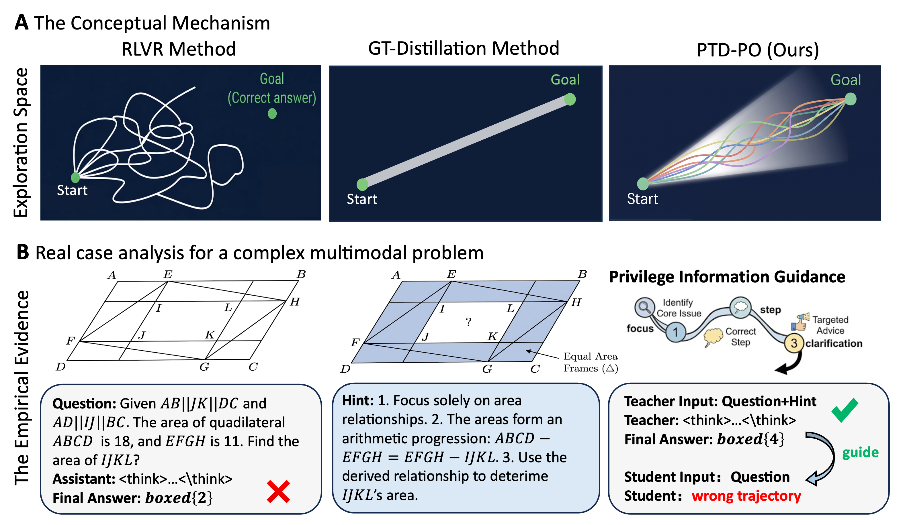
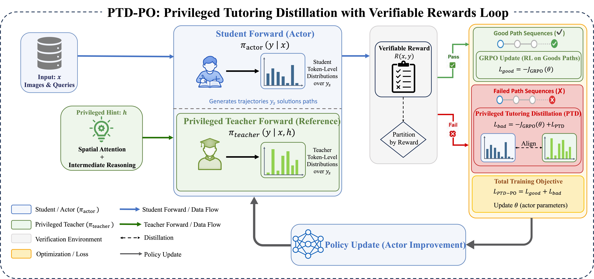
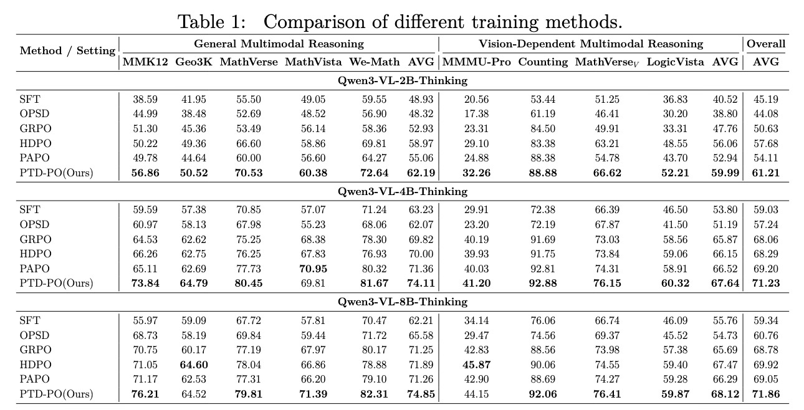

# PTD-PO: Privileged Tutoring Distillation for Multimodal Policy Optimization

[](https://github.com/XszNeverSleep/PTD-PO)
[](https://arxiv.org/abs/2606.07000)                                                                                                                                                                                                    [](./LICENSE)

Official implementation of PTD-PO(Privileged Tutoring Distillation for Multimodal Policy Optimization)

PTD-PO is a reinforcement learning framework for multimodal reasoning that introduces **privileged tutoring distillation** into RLVR training. Instead of revealing the answer or complete reasoning trace, PTD-PO teaches the model through carefully constructed answer-free hints, providing dense token-level supervision while preserving exploration during policy optimization.

Built upon the scalable training infrastructure of EasyR1, PTD-PO supports efficient post-training for large vision-language models and consistently improves multimodal reasoning performance across different model scales.

---

## 🚀 News

- **[2026-06-04]** We released the first **PTD-PO** codebase.

---

## 🎯 TODO List

- [ ] Release the dataset 
- [x] Release the source code

## ✨ The Key Insight: Teaching The Way, Not The Answer

Reinforcement Learning with Verifiable Rewards (RLVR) has significantly improved multimodal reasoning. However, outcome rewards are sparse and only supervise the final answer.

When a rollout fails, RLVR provides little information about:

- Which visual evidence was ignored.
- Which reasoning step was incorrect.
- How the trajectory should be corrected.

Existing self-distillation methods often rely on ground-truth answers or complete solutions, which may introduce shortcut learning and reduce exploration.

PTD-PO addresses this issue by introducing **privileged tutoring distillation**:

> Teach the reasoning path, not the final answer.

The teacher receives answer-free privileged hints, while the student continues learning from the original question-only context.

<p align="center">
  
</p>


---

## 🏗 Framework Overview

PTD-PO combines standard RLVR optimization with privileged tutoring distillation.

During training, the actor samples responses from the original multimodal prompt and receives verifiable rewards through GRPO-style optimization. For failed trajectories, a frozen reference model is queried under a hint-augmented context containing privileged spatial and reasoning guidance. The resulting teacher distribution is then aligned with the student through a lightweight token-level distillation objective.

To further stabilize asymmetric teacher-student alignment, PTD-PO introduces a memory-efficient **Top-K Jensen–Shannon Distillation** objective with tail compensation, reducing distillation overhead while preserving informative probability mass.

<p align="center">
  
</p>


PTD currently supports:

- PTD-GRPO and PTD-GSPO training scripts.
- Top-k teacher distillation with tail compensation.
- Full-vocabulary distillation for exact KL/JSD when memory allows.
- Frozen reference teacher or old-policy teacher modes.
- Hint-augmented text/VLM prompts through `prompt_with_hint`.

---

## 🏆Main Results

PTD-PO consistently improves multimodal reasoning performance over RLVR baselines and existing distillation methods across Qwen3-VL models ranging from 2B to 8B parameters.

<p align="center">
  
</p>


---

## Getting Started

### 1. Environment

Recommended environment follows EasyR1:

- Python 3.9+
- `transformers>=4.54.0`
- `flash-attn>=2.4.3`
- `vllm>=0.8.3`

We recommend the EasyR1 Docker image:

```bash
docker pull hiyouga/verl:ngc-th2.8.0-cu12.9-vllm0.11.0
docker run -it --ipc=host --gpus=all hiyouga/verl:ngc-th2.8.0-cu12.9-vllm0.11.0
```

### 2. Installation

```bash
git clone https://github.com/XszNeverSleep/PTD-PO.git
cd PTD-PO
pip install -e .
```

### 3. Training with PTD

Run a PTD-GRPO example:

```bash
bash examples/ptd-grpo/qwen3_vl_4b_thinking_ViRL39K_ref_ptd-grpo_jsd_top100_5e-1.sh
```

Run the multi-node variant from the Ray head node:

```bash
bash examples/ptd-grpo/launch_multinode.sh \
  examples/ptd-grpo/qwen3_vl_4b_thinking_ViRL39K_ref_ptd-grpo_jsd_top100_5e-1_thr_1_rollout_8.sh
```

Core PTD options use the `ptd` namespace:

```bash
algorithm.enable_ptd=true
algorithm.ptd_threshold=1.0
algorithm.ptd_top_k=100
algorithm.ptd_coef=5.0e-1
algorithm.ptd_kl_direction=jsd_kl
algorithm.ptd_use_ref_teacher=true
```

### 4. Merge Checkpoints

```bash
python3 scripts/model_merger.py \
  --local_dir checkpoints/easy_r1/exp_name/global_step_1/actor
```

---

## Data Format

PTD uses the standard EasyR1 dataset interface plus an optional hint-augmented prompt column:

- `prompt`: student prompt.
- `answer`: ground-truth answer for reward computation.
- `images` / `videos`: optional multimodal inputs.
- `prompt_with_hint`: privileged teacher prompt used only for PTD teacher scoring.

Enable hint loading with:

```bash
data.prompt_with_hint_key=prompt_with_hint
data.max_hint_prompt_length=4096
```

---

## Repository Structure

```text
examples/ptd-grpo/        PTD-GRPO and PTD-GSPO training scripts
examples/reward_function/ Reward functions for math and VLM reasoning
verl/trainer/             RL training loop and PTD mask construction
verl/workers/actor/       Actor update, teacher scoring, and PTD loss
scripts/model_merger.py   FSDP checkpoint merger
```

---

## Acknowledgements

PTD-PO is built on [EasyR1](https://github.com/hiyouga/EasyR1), [veRL](https://github.com/volcengine/verl), [vLLM](https://github.com/vllm-project/vllm), and the broader open-source VLM RL ecosystem. We thank the original authors for providing a strong and extensible training foundation.

---

## Citation

Citation information will be updated with the paper release. For now, please cite this repository if you use PTD-PO:

```bibtex
@misc{ptdpo2026,
  title        = {PTD-PO: Privileged Tutoring Distillation for Multimodal Policy Optimization},
  howpublished = {\url{https://github.com/XszNeverSleep/PTD-PO}},
  year         = {2026}
}
```
